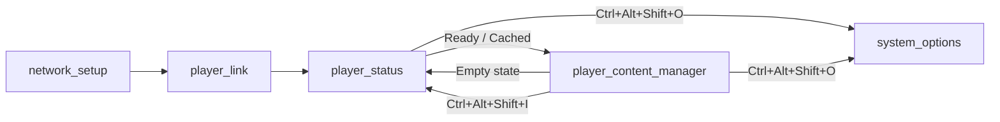

# v10-0 MANAGER — Content Manager & Page Architecture

**Date Range:** February 28, 2026  
**Images:** v10-0-0-MANAGER  
**Codename:** MANAGER

---

## Overview

The v10-0 MANAGER release introduces the content rendering engine and restructures the page architecture. `player_content_manager.html` is the primary signage display page — a full-screen slideshow renderer with socket.io real-time deploy push. The player status page becomes a temporary lobby that redirects to the content manager.

## Key Changes

### New Pages

| Page | Purpose |
|------|---------|
| `player_content_manager.html` | Full-screen slideshow renderer (images/videos) |

### Renamed Pages

| Old Name | New Name |
|----------|----------|
| `player_ready.html` | `player_status.html` |
| `enrolling.html` | `player_registration.html` |

### Player Content Manager

- Full-screen slideshow: images (`object-fit: contain`) + videos (autoplay, muted)
- Assets served from local `/cache/{filename}` (Express static)
- Content polling every 60s with hash-based change detection
- **Socket.io real-time deploy push** — instant content update from ODS Cloud
- Player registration, heartbeat, disconnect handling
- Empty state → redirect back to `player_status.html`
- All keyboard shortcuts: `Ctrl+Alt+Shift+I/K/O/B`
- Offline border system (6 templates with animations)

### Player Status Page Overhaul

- Title: "Otter Digital Signage" (subtitle removed)
- Status field: Online (green) / Cached (white) / Offline (red)
- New pill: "Loading cache..." (purple pulse)
- Auto-redirect to content manager: "Ready" → 3s, "Loading cache..." → 3s
- **Stale slideshow code removed** (~137 lines — rendering now owned by content manager)

### ODS Server Cleanup

- **Deleted `player-config.js`** — duplicate config builder with inconsistent hash
- Atlas players use `/api/device/config/:uuid` exclusively (device-config.js)

### Keyboard Shortcuts (Full Set)

| Shortcut | Action |
|----------|--------|
| `Ctrl+Alt+Shift+I` | Player Info — navigate to player_status.html |
| `Ctrl+Alt+Shift+K` | Kill — restart signage (webserver + chromium) |
| `Ctrl+Alt+Shift+O` | Options — navigate to system_options.html |
| `Ctrl+Alt+Shift+B` | Border — cycle offline border debug templates |

## Page Flow

