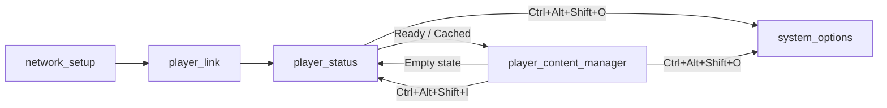

# v10-1 MANAGER — Server Modularization & Test Suite

**Date Range:** March 4, 2026  
**Images:** v10-1-0-MANAGER  
**Codename:** MANAGER

---

## Overview

The v10-1 MANAGER release refactors the monolithic `server.js` into a modular Express router architecture and adds the first comprehensive test suite. The firstboot script is updated to deploy the new `routes/` directory.

## Key Changes

### Server Modularization

| Area | Change |
|------|--------|
| `server.js` | Refactored from 1,165 → 194 lines (core setup, middleware, static serving) |
| `routes/system.js` | System info, status, restart, display config, reboot, shutdown |
| `routes/admin.js` | Admin auth, password changes, factory reset |
| `routes/network.js` | WiFi scan/connect, AP control, network configure, DHCP/static |
| `routes/content.js` | Content delivery, cache management, deploy push, zone rendering |

### Test Suite (78/78 Passing)

| Suite | Tests | Coverage |
|-------|-------|----------|
| `tests/routes/system.test.js` | 17 | All system endpoints + restart-signage |
| `tests/routes/admin.test.js` | 18 | Auth flow, password change, factory reset |
| `tests/routes/network.test.js` | 23 | WiFi connect/disconnect, AP lifecycle, static IP |
| `tests/routes/content.test.js` | 20 | Content polling, cache, deploy push, zones |

### Firstboot Fix

| Area | Change |
|------|--------|
| `atlas_firstboot.sh` | Added `routes/` directory copy to `deploy_atlas()` — critical for P:0 builds |

## Page Flow

